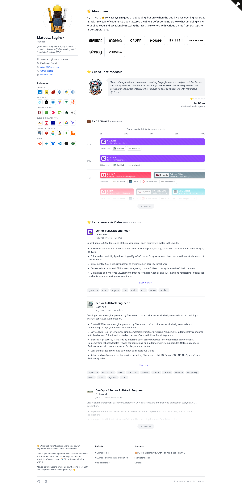

# Mati365 - Portfolio

Hi, I'm Mati. My cat says I'm good at debugging, but only when the bug involves opening her treat jar. With 10 years of experience, I've mastered the fine art of pretending I know what I'm doing while wrangling code and occasionally mowing the lawn. I'm not afraid of any job – whether it's fixing a critical bug or conquering overgrown grass. After all, lawnmowers rarely throw runtime errors (but I'm sure I'll find a way).

## Installation

1. Clone the repository: `git clone
2. Install the dependencies: `npm install`
3. Start the development server: `npm run dev`
4. Open the site in your browser: `http://localhost:4321`
